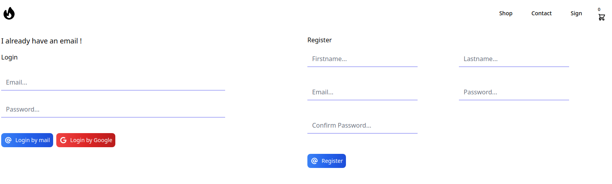
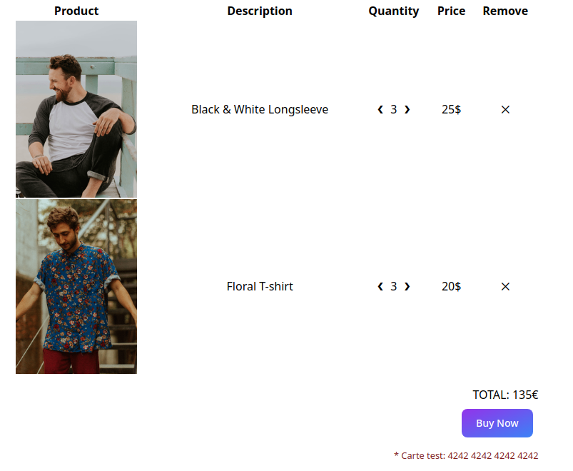

# 🔥 TS X REACT X TAILWIND 🔥

### What is that ?
<a href="https://reactjs.org/" target="_blank">  </a>
<a href="https://www.typescriptlang.org/" target="_blank" rel="noreferrer">  </a> 

**Homepage**


--------------------------

**Authentification**



--------------------------

**Shop Page**


--------------------------

**Cart**



--------------------------


### React Router Dom V6

- Routes
```tsx
    <Routes>
        <Route path="*" element={<NotFound />} />
        <Route path="check-email" element={<CheckEmail />} />
        <Route path="forgot-password" element={<ForgotPassword />} />
        <Route path="/" element={<PrivateRoute component={Users}/>} />
    </Routes>
```

- UseNavigate
```tsx
    const navigate = useNavigate();
    <IconButton size="small" onClick={() => navigate(edit)}>
```

- Navigate
```tsx
    return !isObject ? <Component /> : <Navigate to="/" />
```

### 100% Safe Code with **type**
```ts
    export type Role = 'user' | 'admin' | 'pro'

   export type Method = 'GET' | 'POST' | 'PUT' | 'PATCH' | 'DELETE'

    export type Header = {
        Authorization?: string,
        jwtToken?: string,
        "Content-Type"?: string,
    }

    export type User = {
        id : UUID,
        firstname: string,
        lastname: string,
        created_at: Date,
        Email: string,
        Role: Role
    }
```

### Props is strongly typed
```tsx
    const resetPassword = async ({email, password, code, confirm_password}:ResetPasswordProps):Promise<SuccessResult> => {}
```

### Variable are safe too
```tsx
    const [data, setData] = useState<DisplayProduct[] | null>(null);
    const [order, setOrder] = useState<'asc' | 'desc'>('asc');
    const [orderBy, setOrderBy] = useState<string>('name');
    const [rowsPerPage, setRowsPerPage] = useState<5 | 10 | 25>(10);
```

# For more detail about React:
- <a href="https://github.com/gmorinn/starter-pack-react" target="_blank">Starter Pack React JS</a>

# For more detail about Golang:
- <a href="https://github.com/gmorinn/starter-pack-goa" target="_blank">Starter Pack Golang</a>